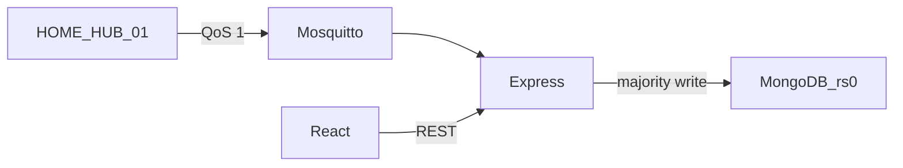

# Smart Tank Automation

Fault-tolerant NoSQL telemetry for one synthetic home water tank, `HOME_HUB_01`.

**Module:** CMP6207 Modern Data Stores

Pipeline: simulator → local Mosquitto → Node.js ingestion → 3-node MongoDB replica set `rs0` → Express API → React dashboard. Overflow and dry-run also send one Telegram message, and the dashboard can play a siren after you arm it.

## Device

| device_id | device_type | location | telemetry |
| --- | --- | --- | --- |
| HOME_HUB_01 | water_tank | home | nested `telemetry.water_tank` (level 20–90%, litres from a 2000 L tank, distance from a 200 cm tank), floats (high ≥ 85, low ≤ 25), valve `CLOSED` when high otherwise `OPEN`, pump `EMERGENCY_STOP` when low otherwise `ACTIVE` |

Every document also has `device_id`, `device_type`, `location`, `timestamp` (BSON Date), `metadata` (`firmware` always `v2.4.1`, `signal_rssi`), plus server-added `alert_reasons`, `alert`, and `ingested_at`. Topic: `iothings/home/telemetry` at QoS 1. Collection: `smart_water.sensor_activations`.

A replica set provides high availability. It is not sharding and it does not scale writes with the number of nodes. If the primary stops, the set elects a new one: automatic failover with no acknowledged-write loss; brief write pause during election (~10 s).



## Quick start (plain terminals)

Do not stop or reconfigure a `mongod` that is already using port 27017 unless you started it for this project and it is this empty `rs0`. `scripts/replica-init.js` refuses `rs.initiate` when that port already holds another database or another replica set.

### 1. Replica set

```bash
mkdir -p mongo-cluster/node1 mongo-cluster/node2 mongo-cluster/node3
```

Three terminals, only when 27017, 27018, and 27019 are free:

```bash
mongod --replSet rs0 --port 27017 --dbpath ./mongo-cluster/node1 --bind_ip localhost
mongod --replSet rs0 --port 27018 --dbpath ./mongo-cluster/node2 --bind_ip localhost
mongod --replSet rs0 --port 27019 --dbpath ./mongo-cluster/node3 --bind_ip localhost
```

Once:

```bash
mongosh --port 27017 --file scripts/replica-init.js
```

`localhost:27017` has priority 2 and should become PRIMARY. The other two become SECONDARY.

### 2. Environment

Copy `.env.example` to `.env`. The API loads it with `dotenv`. Leave the Telegram values blank to store readings without sending messages. Never commit `.env`.

```bash
MONGO_URI=mongodb://127.0.0.1:27017,127.0.0.1:27018,127.0.0.1:27019/smart_water?replicaSet=rs0
MQTT_URL=mqtt://127.0.0.1:1883
PORT=3000
TELEGRAM_BOT_TOKEN=
TELEGRAM_CHAT_ID=
```

### 3. Mosquitto

```bash
mosquitto -c mosquitto/mosquitto.conf
```

The lab config allows anonymous clients on port 1883. That is not a production setup: a real broker needs authentication and TLS.

### 4. Application

```bash
npm install
npm run seed
npm run server
npm run simulator
```

`npm run seed` only writes `synthetic_sensor_dataset.json` (1200 documents from `2026-09-01T00:00:00.000Z`, gaps of 3–8 seconds). It does not insert into MongoDB.

Dashboard, in another terminal:

```bash
cd web
npm install
npm run dev
```

Open http://localhost:5173. Click **Arm siren** once if you want a sound when the tank overflows (level at or above 85%) or hits dry-run (at or below 25%). **Silence** stops the current sound. The page stays quiet until that click, because browsers block audio until a gesture.

Telegram: the server sends one message when overflow or dry-run starts, and one more when the alert clears. It does not send on every reading while the same alert is still active. A failed Telegram call does not drop the MongoDB insert.

Other commands:

```bash
npm run benchmark
node src/smoke.js
```

Failover screenshots: [docs/failover-steps.md](docs/failover-steps.md).

## API

Base URL `http://localhost:3000`. CORS allows `http://localhost:5173`. Paginated routes cap `limit` at 100. Bad dates, buckets, and alert reasons return 400.

| Method | Path | Role |
| --- | --- | --- |
| GET | `/api/health` | `replSetGetStatus`: set name, primary, member state and health |
| GET | `/api/telemetry/latest` | Newest `HOME_HUB_01` document |
| GET | `/api/telemetry/alerts` | High-float or low-float documents, optional `reason` |
| GET | `/api/telemetry/analytics/averages` | Per-device averages (`secondaryPreferred`) |
| GET | `/api/telemetry/history` | Tank documents, or minute/hour level buckets |
| GET | `/api/telemetry/summary` | Trend, litres per hour, time estimate, last-hour min/max, last seen, RSSI |

A device is online when its latest timestamp is under 30 seconds old, otherwise offline.

## Design decisions

- **One collection, one nested tank document.** `smart_water.sensor_activations` keeps `telemetry` nested. That is the schema-flexibility point versus a wide table of nulls.
- **Majority writes.** `insertOne` uses `w: "majority"` with `retryWrites` and `retryReads`, so an acknowledgement means a majority of the replica set has the write.
- **Secondary reads for analytics.** Averages and bucketed history use `secondaryPreferred`. Those numbers can lag the primary by a short replication delay. Latest readings and health stay on the primary.
- **TTL.** A 30-day TTL index on `timestamp` is the storage-limitation control. Readings are synthetic, which is the UK GDPR rationale for this coursework dataset.
- **Availability, not scale.** Every member holds a full copy. Reads can move to secondaries. Writes still enter through the primary.
- **QoS 1.** Telemetry is at-least-once. A redelivery can insert a second document. That limitation is accepted for the lab.
- **Alerts leave the machine two ways.** Telegram is server-side and uses the bot token only from the environment. The siren is synthesised in the browser and never includes a credential.

## Limitations

- Everything runs on one machine. An election here does not prove survival of a host failure.
- The broker is anonymous and unencrypted.
- Stopping the primary causes a brief write pause during election (~10 s).
- The UI polls every 5 seconds (2 seconds on `/cluster`). It is not a change stream.
- The siren plays only in a browser tab that has been armed with a click.

## Optional Docker

`docker-compose.yml` publishes MongoDB on **27217–27219** so it does not bind port 27017 or 27018–27019. Do not run it at the same time as the host replica set or a host Mosquitto already using port 1883.

```bash
docker compose up -d
bash scripts/init-replica.sh
export MONGO_URI="mongodb://localhost:27217,localhost:27218,localhost:27219/smart_water?replicaSet=rs0"
bash scripts/failover-demo.sh
```

## Layout

```
plan/                 coursework notes and report outline
src/                  ingestion API, simulator, seed, benchmark, smoke test
web/                  React dashboard
scripts/              mongosh init, optional Docker helpers
docs/failover-steps.md
mosquitto/mosquitto.conf
.env.example
```

UI details: [web/README.md](web/README.md).
