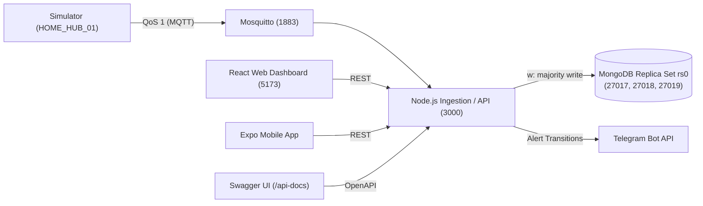

# Smart Tank Automation: Distributed NoSQL Telemetry Platform

[](https://nodejs.org/)
[](https://www.mongodb.com/)
[](https://mosquitto.org/)
[](http://localhost:3000/api-docs)
[](https://react.dev/)
[](https://expo.dev/)

> **Academic Module:** CMP6207 Modern Data Stores (Level 6)  
> **Institution:** Birmingham City University  
> **Coursework Deliverable:** Distributed NoSQL Sensor Ingestion, Automation, and Analytics Platform for **IoThings Home Automation Solutions**.

---

## Overview

**Smart Tank Automation** is a fault-tolerant, distributed IoT telemetry and control platform designed for smart residential water storage and boosting installations (`HOME_HUB_01`). 

The platform continuously monitors physical water levels, calculates volume and distance, applies hardware safety interlocks, detects anomalous pipe leaks, and orchestrates closed-loop pump control. The backend ingestion engine persists telemetry into a **3-node MongoDB Replica Set (`rs0`)** enforcing majority write durability (`w: "majority"`), while analytical workloads leverage secondary read preferences (`secondaryPreferred`).

The system includes interactive **Swagger OpenAPI documentation**, an automated 12-stage test runner (`npm test`), a **React 18 web dashboard** with real-time failover monitoring, and an **Expo mobile client**.

---

## Architecture & Data Flow



### Key Engineering Features:
1. **High Availability Distributed Clustering (`rs0`)**: A 3-node MongoDB replica set on ports 27017, 27018, and 27019. If the primary node stops, the cluster elects a new primary in ~10s with zero acknowledged-write loss.
2. **Durability & Isolation**: Telemetry inserts use `w: "majority"` with `retryWrites` and `retryReads`. Heavy analytical aggregations route to `secondaryPreferred`.
3. **Multi-Collection Data Store (`smart_water`)**:
   - `sensor_activations`: High-velocity telemetry with compound B-Tree indexes and a **30-day TTL index** (satisfying UK GDPR data minimization).
   - `homes`: Customer property metadata and utility tariffs.
   - `devices`: IoT asset registry, dimensions, and firmware versions.
   - `alerts`: Operational audit trail of warnings, alarms, and leaks.
4. **Algorithmic Leak Detection & Safety Interlocks**:
   - **Overflow Protection**: Shuts inlet valve when level $\ge 85\%$.
   - **Dry-Run Protection**: Emergency pump shutdown when level $\le 25\%$ to prevent motor burnout.
   - **Rate-of-Drop Leak Detection**: Identifies pipe ruptures when water drops $>2.5\%$ in $<30$s while the pump is idle.
   - **Closed-Loop Hysteresis Control**: Automatic refilling buffer preventing motor relay chattering (`AUTO` and `MANUAL` modes).
5. **Real-World Notification & Audio Alarms**: Automated Telegram messages upon alert state changes, plus a synthesized Web Audio browser siren.

---

## Quick Start

### 1. Prerequisites
- **Node.js**: v18.0.0 or higher
- **MongoDB Community Server**: v6.0+ (mongod & mongosh)
- **Eclipse Mosquitto**: Native binary or Docker

---

### 2. Environment Configuration

Copy `.env.example` to `.env`:
```bash
cp .env.example .env
```
Ensure your `.env` contains:
```env
MONGO_URI=mongodb://127.0.0.1:27017,127.0.0.1:27018,127.0.0.1:27019/smart_water?replicaSet=rs0
MQTT_URL=mqtt://127.0.0.1:1883
PORT=3000
TELEGRAM_BOT_TOKEN=
TELEGRAM_CHAT_ID=
```
*(Leave Telegram fields empty to log alerts locally without external dispatch).*

---

### 3. Launch Services

#### Step 3.1: Start Mosquitto Broker
```bash
# Via Docker (Recommended):
docker run -d --name mosquitto-broker -p 1883:1883 eclipse-mosquitto mosquitto -c /mosquitto-no-auth.conf

# OR Native:
mosquitto -c mosquitto/mosquitto.conf
```

#### Step 3.2: Start 3-Node MongoDB Replica Set
```bash
# Create directory structure
mkdir -p mongo-cluster/node1 mongo-cluster/node2 mongo-cluster/node3

# Start the three instances (in background with logs):
mongod --replSet rs0 --port 27017 --dbpath ./mongo-cluster/node1 --bind_ip localhost --fork --logpath ./mongo-cluster/node1/mongod.log
mongod --replSet rs0 --port 27018 --dbpath ./mongo-cluster/node2 --bind_ip localhost --fork --logpath ./mongo-cluster/node2/mongod.log
mongod --replSet rs0 --port 27019 --dbpath ./mongo-cluster/node3 --bind_ip localhost --fork --logpath ./mongo-cluster/node3/mongod.log

# Initiate the replica set (once):
mongosh --port 27017 --file scripts/replica-init.js
```

#### Step 3.3: Install Dependencies & Seed Database
```bash
npm install
npm run seed
```
*(Generates 1,200 synthetic readings in `synthetic_sensor_dataset.json` and seeds `homes`, `devices`, `sensor_activations`, and `alerts`)*.

#### Step 3.4: Run Automated Verification Tests
```bash
npm test
```
*Executes the 12-assertion automated test suite covering validation, rules, CRUD, and cluster health.*

#### Step 3.5: Start Ingestion API Server & Edge Simulator
```bash
# Terminal 1: Ingestion API
npm run server

# Terminal 2: Simulator
npm run simulator
```

---

### 4. Client Interfaces

#### A. Web Dashboard (React 18 + Vite + Tailwind)
```bash
cd web
npm install
npm run dev
```
Open **[http://localhost:5173](http://localhost:5173)** in your browser:
* **Dashboard (`/`)**: Animated water gauge, volume, actuator badges, and siren arming.
* **History (`/history`)**: Interactive time-series trends with CSV export.
* **Alerts (`/alerts`)**: Live filterable operational alert records.
* **Cluster Monitor (`/cluster`)**: 3-node replica set status and automatic failover detection banner.

#### B. Interactive Swagger API Documentation
Open **[http://localhost:3000/api-docs](http://localhost:3000/api-docs)** to inspect and test all API endpoints with interactive requests.

#### C. Mobile App (Expo / React Native)
```bash
cd mobile
npm install
npx expo start
```
Scan the QR code with **Expo Go** on Android or iOS connected to the same Wi-Fi network.

---

## API Reference

Base URL: `http://localhost:3000` | Swagger UI: `http://localhost:3000/api-docs`

| Method | Path | CRUD Role | Description |
| :--- | :--- | :--- | :--- |
| **GET** | `/api/health` | Read | Replica set cluster health and member states |
| **GET** | `/api/replica-status` | Read | Dedicated compact replica set status |
| **GET** | `/api/homes` | Read | List smart home properties and tariff configurations |
| **GET** | `/api/devices` | Read | List registered IoT hardware devices and metadata |
| **GET** | `/api/telemetry/latest` | Read | Most recent sensor activation document |
| **GET** | `/api/telemetry/alerts` | Read | Paginated alerts filterable by reason |
| **GET** | `/api/telemetry/history` | Read | Historical readings or bucketed aggregations |
| **GET** | `/api/telemetry/summary` | Read | Consumption rate, filling/emptying estimates, min/max |
| **GET** | `/api/telemetry/analytics/averages` | Read | Aggregated averages executed on `secondaryPreferred` |
| **POST** | `/api/telemetry` | **Create** | Ingest one reading (`{ "ultrasonic_depth_pct": 0-100 }`) with `w: majority` |
| **PATCH**| `/api/telemetry/:id` | **Update** | Update level and automatically recompute derived physics & alerts |
| **DELETE**| `/api/telemetry/:id` | **Delete** | Delete reading by ObjectId (returns 404 if not found) |
| **GET/POST**| `/api/telemetry/control` | Control | Get or set automation mode (`AUTO` / `MANUAL`) and actuator commands |

---

## Failover Testing Procedure

To demonstrate distributed high availability:
1. Ensure the web dashboard is open on **`http://localhost:5173/cluster`**.
2. Stop the primary `mongod` instance (port 27017):
   ```bash
   mongosh --port 27017 --eval "db.adminCommand({ shutdown: 1 })"
   ```
3. Observe the dashboard: the cluster banner switches to **"Failover detected"**, and either Node 2 (port 27018) or Node 3 (port 27019) is promoted to `PRIMARY`.
4. Restart Node 1:
   ```bash
   mongod --replSet rs0 --port 27017 --dbpath ./mongo-cluster/node1 --bind_ip localhost --fork --logpath ./mongo-cluster/node1/mongod.log
   ```
5. Node 1 automatically rejoins as a healthy `SECONDARY` and synchronizes oplog entries.

---

## Repository Layout

```text
├── report/
│   ├── REPORT.md              # Complete 4,000-word Level 6 Coursework Report
│   └── images/                # Evidence screenshots for assessment
├── plan/                      # Requirements, architecture, and coursework specs
├── docs/                      # Failover guides and procedures
├── src/
│   ├── server.js              # Express API, MQTT subscriber, and ingestion engine
│   ├── simulator.js           # HOME_HUB_01 edge water tank simulator
│   ├── seed.js                # Synthetic dataset generator and multi-collection seeder
│   ├── test.js                # Automated test runner (npm test)
│   ├── benchmark.js           # Explain executionStats query benchmarking
│   ├── smoke.js               # Boundary and endpoint smoke checks
│   └── lib/
│       ├── config.js          # Environment and collection constants
│       ├── devices.js         # Device model, validation, rules, and control
│       ├── indexes.js         # Compound and TTL index definitions
│       ├── insights.js        # Trend analysis and consumption math
│       ├── swagger.js         # OpenAPI 3.0 specification definition
│       └── telegram.js        # Telegram Bot notification engine
├── web/                       # React 18 + Vite + Tailwind CSS Web Dashboard
├── mobile/                    # Expo / React Native Mobile Application
├── mosquitto/                 # Mosquitto broker configuration
├── scripts/                   # Replica set initialization scripts
├── synthetic_sensor_dataset.json # Seeded synthetic dataset (1,200 records)
├── package.json
└── README.md
```

---

## Assessment Compliance

This codebase and accompanying report directly address all Learning Outcomes for **CMP6207 Modern Data Stores**:
* **LO1 (20%)**: Comprehensive theoretical appraisal of NoSQL types (Key-Value, Document, Wide-Column, Graph), CAP, PACELC, and BASE vs ACID.
* **LO2 (20%)**: Critical comparison of Relational vs NoSQL, schema evolution, impedance mismatch, and evaluation of *"NoSQL as an extension of SQL"*.
* **LO4 (20%)**: Hands-on deployment of a distributed 3-node MongoDB replica set with majority write concerns, failover verification, index optimizations, and full CRUD provision.

See [report/REPORT.md](report/REPORT.md) for the complete academic report.
