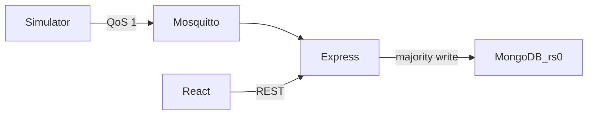

# Smart Tank Automation

Fault-tolerant NoSQL telemetry for a synthetic building: two water tanks, a plant-room climate sensor, and a power meter.

**Module:** CMP6207 Modern Data Stores

Pipeline: simulated devices → MQTT (Mosquitto) → Node.js ingestion → 3-node MongoDB replica set `rs0` → Express API → React dashboard.

A replica set provides high availability. It is not sharding and it does not scale writes with the number of nodes. If the primary stops, the set elects a new one: automatic failover with no acknowledged-write loss; brief write pause during election (~10 s).



## Quick start (plain terminals)

No hosts-file entry is required. Members are `localhost` ports. Do not stop or reconfigure any `mongod` already using port 27017.

### 1. Replica set

```bash
mkdir -p mongo-cluster/db mongo-cluster/db1 mongo-cluster/db2
```

Three terminals:

```bash
mongod --replSet rs0 --port 27117 --dbpath ./mongo-cluster/db --bind_ip localhost
mongod --replSet rs0 --port 27118 --dbpath ./mongo-cluster/db1 --bind_ip localhost
mongod --replSet rs0 --port 27119 --dbpath ./mongo-cluster/db2 --bind_ip localhost
```

Once:

```bash
mongosh --port 27117 --file scripts/replica-init.js
```

`localhost:27117` has priority 2 and should become PRIMARY. The other two become SECONDARY.

### 2. Environment

The API defaults are already these URLs. Export them only if you need to override.

bash:

```bash
export MONGO_URI="mongodb://localhost:27117,localhost:27118,localhost:27119/iothings?replicaSet=rs0"
export MQTT_URL="mqtt://localhost:1883"
```

PowerShell:

```powershell
$env:MONGO_URI="mongodb://localhost:27117,localhost:27118,localhost:27119/iothings?replicaSet=rs0"
$env:MQTT_URL="mqtt://localhost:1883"
```

### 3. Mosquitto

```bash
mosquitto -c mosquitto/mosquitto.conf
```

The lab config allows anonymous clients on port 1883. That is not a production setup: a real broker needs authentication and TLS.

### 4. Application

```bash
npm install
npm run seed
npm run server
npm run simulator
```

Dashboard, in another terminal:

```bash
cd web
npm install
npm run dev
```

Open http://localhost:5173.

Other commands:

```bash
npm run benchmark
node src/smoke.js
```

Failover screenshots: [docs/failover-steps.md](docs/failover-steps.md).

## API

Base URL `http://localhost:3000`. CORS allows `http://localhost:5173`. Paginated routes cap `limit` at 100. Bad dates, metrics, buckets, and alert reasons return 400.

| Method | Path | Role |
| --- | --- | --- |
| GET | `/api/health` | `replSetGetStatus`: set name, primary, member state and health |
| GET | `/api/devices` | Last reading per device; online if seen within 30 s, else stale or offline |
| GET | `/api/telemetry/latest?device_id=` | Newest document, optionally for one device |
| GET | `/api/telemetry` | Filter by device, type, and `from`/`to`, with `page` and `limit` |
| GET | `/api/telemetry/series` | `$dateTrunc` average/min/max for a whitelisted metric |
| GET | `/api/alerts` | Alert documents, optional `reason` |
| GET | `/api/analytics/averages` | Per-device counts and averages (`secondaryPreferred`) |
| GET | `/api/analytics/alerts-hourly` | Alert reasons by hour (`secondaryPreferred`) |
| GET | `/api/stats` | Collection size, last hour, active alerts, devices online |
| POST | `/api/devices/:id/commands` | `{ "command": "pump_on" \| "pump_off" \| "valve_open" \| "valve_close" }` for water tanks |

Series metrics: `ultrasonic_depth_pct`, `volume_litres`, `distance_cm`, `temperature_c`, `humidity_pct`, `co2_ppm`, `voltage_v`, `power_w`, `current_a`, `energy_kwh_total`.

## Design decisions

- **One collection, three shapes.** `iothings.sensor_readings` stores tank, climate, and power documents. Fields a device does not measure are omitted. That is the schema-flexibility point versus a wide table of nulls.
- **Majority writes.** `insertOne` uses `w: "majority"` with `retryWrites` and `retryReads`, so an acknowledgement means a majority of the replica set has the write.
- **Secondary reads for analytics.** Averages and the hourly alert aggregation use `secondaryPreferred`. Those numbers can lag the primary by a short replication delay. Latest readings and health stay on the primary.
- **TTL.** A 30-day TTL index on `timestamp` is the storage-limitation control. Readings are synthetic, which is the UK GDPR rationale for this coursework dataset.
- **Availability, not scale.** Every member holds a full copy. Reads can move to secondaries. Writes still enter through the primary.
- **QoS 1.** Telemetry is at-least-once. A redelivery can insert a second document. That limitation is accepted for the lab.

## Limitations

- Everything runs on one machine. An election here does not prove survival of a host failure.
- The broker is anonymous and unencrypted.
- Stopping the primary causes a brief write pause during election (~10 s).
- The UI polls every 5 seconds (2 seconds on `/cluster`). It is not a change stream.

## Optional Docker

`docker-compose.yml` publishes MongoDB on **27217–27219** so it does not bind port 27017 or the host coursework ports. Do not run it at the same time as the host replica set or a host Mosquitto already using port 1883.

```bash
docker compose up -d
bash scripts/init-replica.sh
export MONGO_URI="mongodb://localhost:27217,localhost:27218,localhost:27219/iothings?replicaSet=rs0"
bash scripts/failover-demo.sh
```

## Layout

```
plan/                 coursework notes and report outline
src/                  ingestion API, simulator, seed, benchmark, smoke test
web/                  React dashboard
scripts/              mongosh init, optional Docker helpers
docs/failover-steps.md
mosquitto/mosquitto.conf
```

UI details: [web/README.md](web/README.md).
