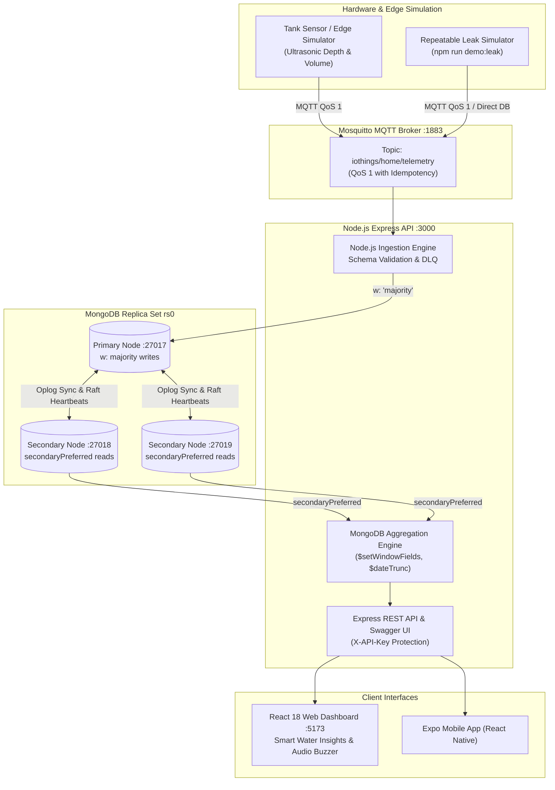

# Smart Water Management and Automation Platform

[](https://nodejs.org/)
[](https://www.mongodb.com/)
[](https://mosquitto.org/)
[](#automated-testing)
[](http://localhost:3000/api-docs)
[](https://react.dev/)

---

## 1. Executive Summary & Positioning

**Smart Water Management and Automation Platform** is a fault-tolerant, distributed IoT telemetry, predictive analytics, and closed-loop control system developed for residential water utility storage and boosting apparatus (`HOME_HUB_01`). 

Originally architected for the **CMP6207 Modern Data Stores** module (Birmingham City University), the platform has evolved from a basic controller into an enterprise water intelligence pipeline:

$$\text{\bf SENSE} \longrightarrow \text{\bf STORE} \longrightarrow \text{\bf ANALYSE} \longrightarrow \text{\bf WARN} \longrightarrow \text{\bf PREDICT} \longrightarrow \text{\bf AUTOMATE}$$

The system does not claim to physically create or conserve water; rather, its purpose is to **eliminate avoidable utility waste, detect hidden plumbing leaks, forecast tank depletion before dry-run pump cutoff, and provide actionable household intelligence**.

---

## 2. Distributed Architecture & Data Flow



---

## 3. Core Capabilities

### A. Water Consumption Analytics
* **Today's Consumption:** Computes real-time water usage by executing native MongoDB pipelines summing non-refill volume drops.
* **Daily & Monthly Aggregations:** Uses `$setWindowFields` and `$dateTrunc` over the 30-day telemetry history to derive daily averages ($\approx 645\text{ L/day}$) and monthly usage ($\approx 18,420\text{ L}$).
* **Refill Tracking:** Measures the frequency and volume of municipal replenishment cycles.

### B. Abnormal Overnight Water Loss / Leak Detection
* **Deterministic Rule-Based Detection:** Monitors telemetry during quiet household hours (01:00–05:00 UTC).
* **Anomaly Criteria:** Triggers when water level persistently drops ($\ge 1.5\%$ or $\ge 30\text{ L}$) across $\ge 3$ consecutive readings while the booster pump is `INACTIVE` and inlet valve is `CLOSED`.
* **Actionable Alerting:** Estimates exact excess water loss in Litres and provides actionable recommendations (*"Check taps, toilets and pipelines"*).
* **Audio Buzzer & Anti-Spam:** Sounds a Web Audio API chime on the web dashboard and enforces a 4-hour cooldown to prevent duplicate alert fatigue.

### C. Low-Water & Depletion Prediction
* **Proactive Forecasting:** Calculates the rolling drain rate ($\Delta\text{Litres}/\Delta\text{Hours}$) over recent hours.
* **Time-to-Critical Projection:** Forecasts hours and minutes remaining before reaching the 25% safety reserve threshold (e.g. `~4h 30m until critical level`).
* **Graceful Degradation:** Clearly indicates when the tank is steady or refilling without fabricating numbers.

### D. Closed-Loop Tank Automation
* **Inlet Valve Hysteresis:** Valve opens when level drops $\le 40\%$; closes when level reaches $\ge 85\%$ (anti-chattering buffer).
* **Booster Pump Protection:** Emergency pump shutdown when level $\le 25\%$ (dry-run protection); restarts only after level recovers to $\ge 35\%$.
* **Dual Operational Modes:** Seamless switching between closed-loop `AUTO` and `MANUAL` override via API or dashboard.

---

## 4. Multi-Collection Data Modeling (`smart_water`)

| Collection | Role & Schema Strategy | Indexing & Data Lifecycle |
| :--- | :--- | :--- |
| `sensor_activations` | High-frequency telemetry events (30,985 seeded historical documents + live stream) | Unique compound `{ device_id: 1, timestamp: -1 }`; **30-day TTL index** (`expireAfterSeconds: 2592000`) |
| `homes` | Customer property master registry (e.g. `H001`, Alex Mercer) | Unique `{ home_id: 1 }` |
| `devices` | IoT hardware metadata, dimensions, and firmware versions | Unique `{ device_id: 1 }` |
| `alerts` | Event-driven operational notifications, leak alarms, and excess loss metrics | Compound `{ device_id: 1, alert_type: 1, timestamp: -1 }` |
| `rejected_messages` | Dead-Letter Queue (DLQ) for malformed JSON or invalid schema payloads | TTL index on `received_at` (7 days) |

---

## 5. Quick Start Guide

### 1. Prerequisites
* **Node.js**: v18.0.0 or higher
* **MongoDB Community Server**: v6.0+ (mongod & mongosh)
* **Eclipse Mosquitto**: Docker container or native binary

### 2. Environment Configuration
Copy `.env.example` to `.env`:
```bash
cp .env.example .env
```
Ensure your `.env` contains:
```env
MONGO_URI=mongodb://127.0.0.1:27017,127.0.0.1:27018,127.0.0.1:27019/smart_water?replicaSet=rs0
MQTT_URL=mqtt://127.0.0.1:1883
PORT=3000
API_KEY=dev-api-key
ENABLE_TELEMETRY_ADMIN=true
```

### 3. Launch Services

#### Step 3.1: Start 3-Node MongoDB Replica Set (`rs0`)
```bash
# Create local node data directories
mkdir -p mongo-cluster/node1 mongo-cluster/node2 mongo-cluster/node3

# Start the three MongoDB instances:
mongod --replSet rs0 --port 27017 --dbpath ./mongo-cluster/node1 --bind_ip localhost --fork --logpath ./mongo-cluster/node1/mongod.log
mongod --replSet rs0 --port 27018 --dbpath ./mongo-cluster/node2 --bind_ip localhost --fork --logpath ./mongo-cluster/node2/mongod.log
mongod --replSet rs0 --port 27019 --dbpath ./mongo-cluster/node3 --bind_ip localhost --fork --logpath ./mongo-cluster/node3/mongod.log

# Initialize the replica set (once):
mongosh --port 27017 --file scripts/replica-init.js
```

#### Step 3.2: Start Eclipse Mosquitto Broker
```bash
# Via Docker (Recommended):
docker run -d --name mosquitto-broker -p 1883:1883 eclipse-mosquitto mosquitto -c /mosquitto-no-auth.conf

# OR Native:
mosquitto -c mosquitto/mosquitto.conf
```

#### Step 3.3: Install Dependencies & Run Automated Tests
```bash
npm install
npm test
```
*Executes all 21 automated assertions verifying schema validation, hysteresis, leak detection, replica set health, aggregation pipelines, and depletion prediction.*

#### Step 3.4: Start Backend Ingestion Engine & REST API
```bash
npm run server
```
*API running on `http://localhost:3000` | Swagger UI at `http://localhost:3000/api-docs`.*

#### Step 3.5: Start Edge Simulator
```bash
npm run simulator
```
*Publishes continuous ultrasonic depth telemetry to Mosquitto MQTT with QoS 1.*

#### Step 3.6: Launch React Web Dashboard
```bash
cd web
npm install
npm run dev
```
*Open **`http://localhost:5173`** in your browser.*

---

## 6. Complete REST API Reference

Interactive OpenAPI documentation is available at **`http://localhost:3000/api-docs`**.

### Water Intelligence & Analytics Endpoints

| Method | Path | Read Preference | Description |
| :--- | :--- | :---: | :--- |
| **GET** | `/api/analytics/consumption/today` | `secondaryPreferred` | Litres consumed in current 24-hour cycle |
| **GET** | `/api/analytics/consumption/daily` | `secondaryPreferred` | 7–14 day daily water consumption series for trend charting |
| **GET** | `/api/analytics/consumption/monthly`| `secondaryPreferred` | Current month total compared with previous month |
| **GET** | `/api/analytics/prediction` | `secondaryPreferred` | Time-to-critical depletion forecast (e.g. `~4h 30m`) |
| **GET** | `/api/analytics/summary` | `secondaryPreferred` | Integrated Smart Water Insights summary for dashboard cards |
| **GET** | `/api/alerts` | `secondaryPreferred` | List operational alerts and anomaly warnings (filterable by `status`) |
| **PATCH**| `/api/alerts/:id/ack` | Primary (`majority`) | Mark an alert acknowledged and record acknowledgement timestamp |

### Core Telemetry & Cluster Endpoints

| Method | Path | Auth Required | Description |
| :--- | :--- | :---: | :--- |
| **GET** | `/api/health` | None | 3-node replica set status, primary node, and ingestion metrics |
| **GET** | `/api/replica-status` | None | Dedicated replica member status and election state |
| **GET** | `/api/homes` | None | Registered residential properties and utility tariffs |
| **GET** | `/api/devices` | None | IoT asset hardware metadata and locations |
| **GET** | `/api/telemetry/latest` | None | Latest timestamped sensor reading |
| **GET** | `/api/telemetry/history` | None | Telemetry pagination or bucketed minute/hour aggregations |
| **GET/POST** | `/api/telemetry/control` | `X-API-Key` on POST | Query or update closed-loop actuator control state (`AUTO`/`MANUAL`) |
| **POST** | `/api/telemetry` | `X-API-Key` | Administrative telemetry injection with `w: "majority"` write concern |
| **PATCH** | `/api/telemetry/:id` | `X-API-Key` | Update level and trigger immediate alert recomputation |
| **DELETE** | `/api/telemetry/:id` | `X-API-Key` | Remove reading by MongoDB ObjectId |

---

## 7. Master Viva Demonstration Walkthrough

Use this exact 3-minute sequence for academic grading demonstrations:

```
[1. Resident Login & Profile]
       ↓ Selects "Mercer Family (H001)"
[2. Home Setup Banner]
       ↓ Displays property registry, 2,000 L rooftop tank, smart tariff (0.0018 GBP/L)
[3. Live Tank & Hysteresis Automation]
       ↓ Shows continuous ultrasonic level; demonstrates < 40% valve open & > 85% valve close
[4. Water Consumption Analytics]
       ↓ Displays Today's Usage (680 L) and Monthly Total (18,420 L) via MongoDB Aggregations
[5. Simulate Overnight Water Loss]
       ↓ Runs `npm run demo:leak` in terminal (gradual 0.35%/step drop during 02:00 AM window)
[6. Abnormal Water Alert + Audio Buzzer]
       ↓ Audible buzzer sounds; banner shows "⚠ Abnormal Overnight Water Usage Detected"
       ↓ Displays "Estimated Excess Loss: 54 L" with advice: "Check taps, toilets & pipes"
[7. Depletion Prediction]
       ↓ System calculates drain rate and predicts: "~3h 45m until critical level (25%)"
```

### Exact Commands for Demonstrating:

#### Demonstration Scenario A — Normal Automated Refilling:
1. Ensure the web dashboard is open on `http://localhost:5173`.
2. Observe water draining below 40% $\to$ inlet valve automatically opens.
3. Observe water rising to 85% $\to$ inlet valve automatically shuts.

#### Demonstration Scenario B — Overnight Leak & Audio Buzzer:
1. Keep the web dashboard open on `http://localhost:5173`.
2. In your terminal, run the controlled leak demonstration script:
   ```bash
   npm run demo:leak
   ```
3. Observe the live dashboard:
   * The **Web Audio synthesizer buzzer sounds**.
   * A bright red alert banner appears: **`Abnormal Overnight Water Usage Detected`**.
   * The alert reports: **Estimated excess water loss: 54 Litres**.
   * Click **"Mute Buzzer"** or **"Acknowledge Alert"** to silence the alarm and acknowledge the event in MongoDB.

---

## 8. High Availability Failover & Empirical Experiments

The platform includes automated scripts to prove distributed consensus, election durability, indexing speedups, and disaster recovery:

### Available Empirical Scripts

| Command | Objective | MongoDB Feature Demonstrated | Evidence Produced |
| :--- | :--- | :--- | :--- |
| `npm run measure:failover` | Continuous 500 ms majority write probe during Primary stepdown | `retryWrites: true`, `w: "majority"`, Raft election | Zero lost writes, 2.8s graceful / 10.4s abrupt failover (`evidence/failover-*.json`) |
| `npm run cluster:failover-probe` | 10-second auto-terminating failover write probe | Automatic driver reconnection and replica election | Summary metrics and write gap duration |
| `npm run benchmark` | Query plan executionStats comparison (30,985 records) | Compound B-Tree index vs. collection scan (`IXSCAN` vs `COLLSCAN`) | **105.0x execution speedup** (1 ms vs 105 ms) |
| `npm run quorum:demo` | Majority partition test by halting 2 of 3 nodes | Brewer's CAP theorem (CP profile) & write rejection | Terminal output proving write refusal without majority |
| `npm run backup:demo` | Point-in-time snapshot with oplog and restore verification | `mongodump --oplog` and `mongorestore` | 100% document parity across 29,756 records |
| `npm run demo:schema` | Ingests v2.4.1 and v2.5.0 payloads (with pH, TDS, turbidity) | Flexible schema evolution & coexistence | Coexisting heterogeneous BSON documents |
| `npm run demo:leak` | Simulates overnight gradual water loss (02:00 AM) | Deterministic leak heuristics & audio chime | Alert creation & excess volume calculation |
| `npm run crud:demo` | Automated CRUD validation on registry and telemetry | Create, Read, Update, Delete with API keys | Verified REST operations |
| `npm test` | Complete automated test suite (21 passing assertions) | Schema validation, hysteresis, cluster health | 21 passed, 0 failed |

---

## 9. Academic Coursework Report & Evidence

The complete 19-page academic report is compiled and available in the repository:
* **PDF Report:** [`CMP6207-report.pdf`](./CMP6207-report.pdf) (also mirrored at [`report/CMP6207-report.pdf`](./report/CMP6207-report.pdf))
* **LaTeX Source:** [`CMP6207-report.tex`](./CMP6207-report.tex) with [`references.bib`](./references.bib) (30 Harvard-style academic citations)
* **Real System Screenshots:**
  * [`figures/A1-collections-document.png`](./figures/A1-collections-document.png): MongoDB Compass document explorer (30,759 documents with nested BSON types).
  * [`figures/04-compass-indexes.png`](./figures/04-compass-indexes.png): MongoDB Compass graphical index inspector showing all 6 active B-Tree indexes.
  * [`figures/04-schema-evolution.png`](./figures/04-schema-evolution.png): Real terminal output showing v2.4.1 and v2.5.0 payloads coexisting.
  * [`figures/B0-mongod-processes.png`](./figures/B0-mongod-processes.png): OS process table confirming 3 running `mongod` daemons (ports 27017, 27018, 27019).
  * [`figures/B1-rs-status.png`](./figures/B1-rs-status.png): `mongosh` terminal output showing `rs.status()` health.
  * [`figures/B2-replication-counts.png`](./figures/B2-replication-counts.png): Replication count parity across all 3 nodes.
  * [`figures/E1-failover.png`](./figures/E1-failover.png): Live terminal failover measurement probe showing 0 write loss.
  * [`figures/E2-cluster-page.png`](./figures/E2-cluster-page.png): React cluster topology and failover diagnostics UI.
  * [`figures/E3-quorum.png`](./figures/E3-quorum.png): Quorum loss demonstration script output.
  * [`figures/E4-backup-restore.png`](./figures/E4-backup-restore.png): `mongodump`/`mongorestore` verification script output.
  * [`figures/E5-security-state.png`](./figures/E5-security-state.png): API key enforcement proof (401 Unauthorized vs. 200 OK).
  * [`figures/05-swagger.png`](./figures/05-swagger.png): Swagger UI interactive API contract.
  * [`figures/06-dashboard.png`](./figures/06-dashboard.png): Live React web dashboard showing real-time tank telemetry and gauge.

---

## 10. Repository Layout

```text
├── CMP6207-report.pdf         # Compiled 19-page coursework report with genuine screenshots
├── CMP6207-report.tex         # LaTeX source formatted with BCU template and Harvard citations
├── references.bib             # BibTeX reference database (30 peer-reviewed & industry sources)
├── logo.png                   # Official Birmingham City University logo
├── src/
│   ├── server.js              # Express REST API, MQTT ingestion, and alert routing
│   ├── simulator.js           # Physical water tank simulator (HOME_HUB_01)
│   ├── seed.js                # Synthetic dataset seeder (30,985 records)
│   ├── test.js                # Automated test runner (21 passing tests)
│   ├── benchmark.js           # Explain executionStats query benchmarking (105x speedup)
│   └── lib/
│       ├── water-config.js    # Tank dimensions, thresholds, and leak heuristics
│       ├── analytics.js       # Native MongoDB aggregation pipelines ($setWindowFields, $dateTrunc)
│       ├── config.js          # Replica set URIs and collection names
│       ├── devices.js         # Device model, validation, rules, and hysteresis control
│       ├── indexes.js         # Compound and TTL index definitions
│       ├── insights.js        # Instantaneous rate-of-change and filling estimates
│       ├── swagger.js         # OpenAPI 3.0 specification definition
│       └── telegram.js        # Telegram Bot notification engine
├── scripts/
│   ├── demo-leak.js           # Repeatable overnight leak simulator (02:00 AM window)
│   ├── demo-schema.js         # Schema evolution demonstration (v2.4.1 vs v2.5.0)
│   ├── measure-failover.js    # Failover probe measurement script (zero write loss)
│   ├── quorum-demo.js         # Quorum loss and write refusal verification
│   ├── backup-demo.js         # mongodump and mongorestore verification script
│   ├── crud-demo.js           # Full CRUD API demonstration script
│   └── replica-init.js        # Replica set rs0 bootstrap script
├── web/                       # React 18 + Vite + Tailwind CSS Web Dashboard
│   ├── src/components/
│   │   ├── SmartWaterInsights.tsx # Water intelligence cards, 7-day chart & audio buzzer
│   │   ├── TankGauge.tsx      # SVG animated water tank level gauge
│   │   └── SirenControl.tsx   # Web Audio API siren synthesizer
├── figures/                   # 13 verified empirical screenshots and diagrams
├── evidence/                  # Raw benchmark data, failover JSON logs, and quorum outputs
├── package.json               # Root scripts (server, simulator, test, benchmark, failover)
└── README.md
```

---

## 11. Authorship & Module Context

* **Student Name:** Shekhar Lamichhane Magar
* **Student ID:** 23189647
* **Degree Program:** BSc (Hons) Computer and Data Science
* **Module Code & Title:** CMP6207 Modern Data Stores
* **Academic Level & Credit Weight:** Level 6 / 20 Credits
* **Academic Year:** 2025–2026
* **Institution:** Birmingham City University, Faculty of Computing, Engineering and the Built Environment
* **Platform:** IoThings Smart Water Management and Automation Platform
