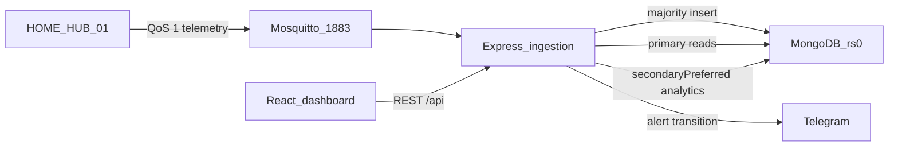

# Architecture

## System

## Data flow

1. `src/simulator.js` builds one nested tank payload and publishes it to `iothings/home/telemetry`.
2. `src/server.js` parses JSON, rejects anything that is not `HOME_HUB_01` with a tank object, and inserts with `w: "majority"`.
3. If the alert set changed, `src/lib/telegram.js` calls `sendMessage`. The insert has already succeeded.
4. The dashboard polls summary, history, alerts, and health. The siren runs only in the browser, after **Arm siren**.

## Replica set topology

| Member | Port | Priority | Data directory |
| --- | --- | --- | --- |
| localhost:27017 | 27017 | 2 | `./mongo-cluster/node1` |
| localhost:27018 | 27018 | 1 | `./mongo-cluster/node2` |
| localhost:27019 | 27019 | 1 | `./mongo-cluster/node3` |

Set name `rs0`. Database `smart_water`. Collection `sensor_activations`.

`scripts/replica-init.js` calls `rs.initiate` only when the connected `mongod` is not yet a replica set and has no user databases. If it is already this `rs0` with these three hosts, it prints member states and does nothing else. Any other set name, member list, or existing user database is a refusal.

Failover wording for the report and the slides: automatic failover with no acknowledged-write loss; brief write pause during election (~10 s).

## Topic naming

One topic: `iothings/home/telemetry`. The broker is the local Mosquitto URL from `MQTT_URL`.

## Frontend component tree

- `AppShell` — navigation, theme, API badge, `SirenControl`
- `Dashboard` — KPIs, `TankGauge`, sparkline, alert feed, cluster mini-status
- `HistoryPage` — level chart, table, CSV
- `AlertsPage` — overflow and dry-run list
- `ClusterPage` — member cards, failover banner, in-memory log

## Stored documents

`telemetry` stays nested. Top-level fields are identity, time, metadata, alerts, and `ingested_at`. Level, litres, distance, floats, and actuator strings live under `telemetry`.
