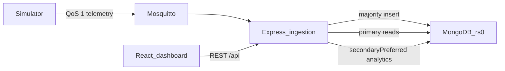
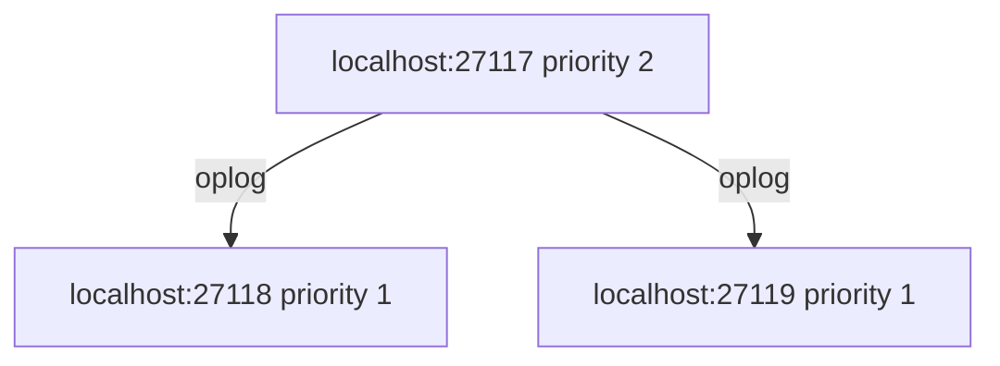
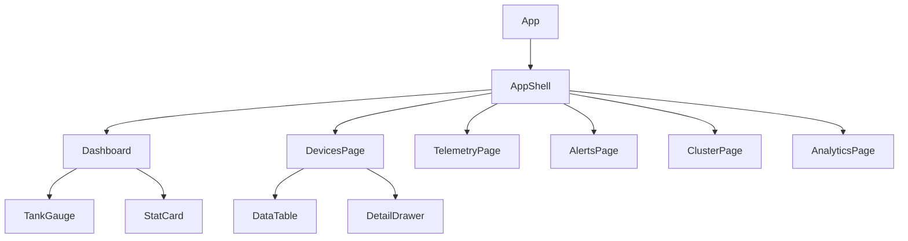

# Architecture

## System



## Data flow

1. `src/simulator.js` builds a payload per device and publishes JSON.
2. Mosquitto delivers `iothings/+/+/telemetry` to `src/server.js`.
3. The server validates `device_id`, `device_type`, `timestamp`, and a `telemetry` object.
4. Type-specific fields are stored at the top level of the document (the `telemetry` wrapper is not kept).
5. Alerts and `ingested_at` are added. `insertOne` waits for majority acknowledgement.
6. The React app calls `/api/*`. Vite proxies `/api` to `http://localhost:3000`.

Command path (stretch): the UI `POST`s a command, the API publishes `iothings/<type>/<id>/commands` at QoS 1, and the simulator applies valve or pump state on later tank payloads.

## Replica set topology

Members, all on this machine:

| Member | Port | Priority | Usual role |
| --- | --- | --- | --- |
| localhost | 27117 | 2 | Preferred primary |
| localhost | 27118 | 1 | Secondary |
| localhost | 27119 | 1 | Secondary |



If the process on 27117 stops, the remaining members elect a new primary. Acknowledged majority writes are not rolled back. Clients see a brief write pause during election (~10 s). When 27117 starts again it rejoins, usually as a secondary, until its higher priority triggers another election.

An existing `mongod` on port 27017 is not part of `rs0` and must not be stopped or reconfigured.

Docker Compose is optional and publishes 27217–27219 so it does not collide with 27017 or with this replica set.

## Topic naming

| Topic | Direction | QoS |
| --- | --- | --- |
| `iothings/<device_type>/<device_id>/telemetry` | device → broker → ingestion | 1 |
| `iothings/<device_type>/<device_id>/commands` | API → broker → simulator | 1 |

`device_type` is `water_tank`, `climate`, or `power_meter`.

## Frontend component tree



## Stored documents

Collection: `iothings.sensor_readings`. Shared fields: `device_id`, `device_type`, `location`, `timestamp` (BSON Date), `metadata`, `alert_reasons`, `alert`, `ingested_at`.

Water tank:

```json
{
  "device_id": "TANK_01",
  "device_type": "water_tank",
  "location": "roof",
  "timestamp": "2026-10-01T12:00:00.000Z",
  "metadata": { "firmware": "1.4.2", "signal_rssi": -62 },
  "water_tank": {
    "ultrasonic_depth_pct": 72.4,
    "volume_litres": 1448,
    "distance_cm": 41.4
  },
  "float_switches": { "high_level_overflow": false, "low_level_dry_run": false },
  "actuator_states": { "inlet_valve": false, "booster_pump": true },
  "alert_reasons": [],
  "alert": false,
  "ingested_at": "2026-10-01T12:00:00.200Z"
}
```

Climate:

```json
{
  "device_id": "CLIMATE_01",
  "device_type": "climate",
  "location": "plant_room",
  "timestamp": "2026-10-01T12:00:03.000Z",
  "metadata": { "firmware": "2.1.0", "signal_rssi": -71 },
  "climate": { "temperature_c": 36.2, "humidity_pct": 58, "co2_ppm": 940 },
  "alert_reasons": ["HIGH_TEMPERATURE"],
  "alert": true,
  "ingested_at": "2026-10-01T12:00:03.180Z"
}
```

Power meter:

```json
{
  "device_id": "POWER_01",
  "device_type": "power_meter",
  "location": "electrical_cupboard",
  "timestamp": "2026-10-01T12:00:06.000Z",
  "metadata": { "firmware": "3.0.1", "signal_rssi": -55 },
  "power_meter": {
    "voltage_v": 238.1,
    "power_w": 3720,
    "current_a": 15.62,
    "energy_kwh_total": 128.4
  },
  "alert_reasons": ["POWER_SPIKE"],
  "alert": true,
  "ingested_at": "2026-10-01T12:00:06.160Z"
}
```

`volume_litres` is `2000 * ultrasonic_depth_pct / 100`. `distance_cm` is the gap from a sensor at the top of a 150 cm tank down to the water surface.

Different devices omit fields they do not measure. That is the schema-flexibility point: one collection, no migration when a new sensor key appears.
