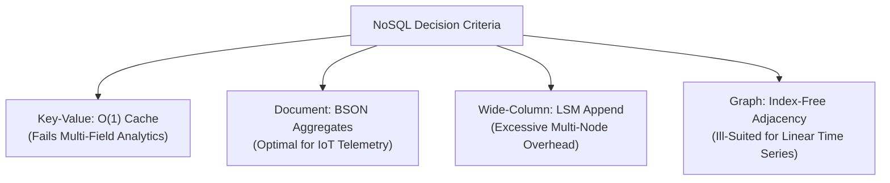

# IoThings Application Report: Smart Tank Telemetry and Control Data Store

**Module:** CMP6207 Modern Data Stores  
**Assessment:** CWRK Professional Implementation Report (Level 6 / 60%)  
**Academic Year:** 2024–2025 / 2026  
**Institution:** Birmingham City University, Faculty of Computing, Engineering and the Built Environment  
**Student Name:** [Enter student name]  
**Student ID:** [Enter student ID]  
**Submission Month/Year:** [Enter actual submission month/year]  
**Main Narrative Workload:** Approximately 4,000 words (Sections 1–6; see word-count record in Appendix F)  

> **Review Notice:** Replace this cover page with, or prepend, the official University Coursework Declaration and Cover Sheet required by Birmingham City University. This draft was prepared with AI-assisted editing and technical structuring. In accordance with BCU Academic Integrity policies and the assessment brief's authorship regulations, the student must review, adapt, and verify all claims, declarations, and code observations prior to formal submission. Bracketed identity placeholders and pending screenshot boxes require attention before final export.

---

## Contents

* [1 Introduction](#1-introduction)
* [2 Principal NoSQL Types and Their Theoretical Basis](#2-principal-nosql-types-and-their-theoretical-basis)
  * [2.1 Key–Value Stores](#21-keyvalue-stores)
  * [2.2 Document Stores](#22-document-stores)
  * [2.3 Wide-Column Stores](#23-wide-column-stores)
  * [2.4 Graph Stores](#24-graph-stores)
  * [2.5 Consistency Theory and Selection](#25-consistency-theory-and-selection)
* [3 Critical Comparison: Relational and Document Databases](#3-critical-comparison-relational-and-document-databases)
  * [3.1 Schema, Relationships and Integrity](#31-schema-relationships-and-integrity)
  * [3.2 Queries, Performance and Scalability](#32-queries-performance-and-scalability)
  * [3.3 Transactions, Consistency and Delivery Guarantees](#33-transactions-consistency-and-delivery-guarantees)
  * [3.4 Governance, Cost and Client Judgement](#34-governance-cost-and-client-judgement)
* [4 Design, Implementation and Distributed Management](#4-design-implementation-and-distributed-management)
  * [4.1 Architecture and Reproducible Setup](#41-architecture-and-reproducible-setup)
  * [4.2 Dataset, Collection Boundaries and Validation](#42-dataset-collection-boundaries-and-validation)
  * [4.3 MQTT Ingestion and Automation](#43-mqtt-ingestion-and-automation)
  * [4.4 Indexes and Analytical Queries](#44-indexes-and-analytical-queries)
  * [4.5 Replication, Failover and Recovery](#45-replication-failover-and-recovery)
  * [4.6 Security and Operational Readiness](#46-security-and-operational-readiness)
* [5 API Implementation and Dashboard Evidence](#5-api-implementation-and-dashboard-evidence)
* [6 Summary, Conclusion and Future Investment](#6-summary-conclusion-and-future-investment)
* [References](#references)
* [Appendix A: Dataset Provenance and Reproducibility](#appendix-a-dataset-provenance-and-reproducibility)
* [Appendix B: Local Installation and Replica-Set Capture](#appendix-b-local-installation-and-replica-set-capture)
* [Appendix C: API Contract and Concrete Examples](#appendix-c-api-contract-and-concrete-examples)
* [Appendix D: Verification, CRUD and Evidence Status](#appendix-d-verification-crud-and-evidence-status)
* [Appendix E: Failover, Backup and Security Captures](#appendix-e-failover-backup-and-security-captures)
* [Appendix F: Source Map, Word Count and Completion Checklist](#appendix-f-source-map-word-count-and-completion-checklist)

---

## List of Figures

* **Figure 1:** Implemented multi-tier pipeline and distributed boundary `[Source-inspected: src/server.js, src/simulator.js]`
* **Figure 2:** MongoDB Replica Set status terminal evidence slot `[Pending capture: 02-replica-status.png]`
* **Figure 3:** Database collections and stored document BSON structure slot `[Pending capture: 03-collections-document.png]`
* **Figure 4:** Query execution plan and compound index explain evidence slot `[Pending capture: 04-index-explain.png]`
* **Figure 5:** Swagger UI interactive API contract overview `[Measured: report/images/05-swagger-overview.png]`
* **Figure 6:** Interactive Swagger execution of GET `/api/health` slot `[Pending capture: 06-swagger-health.png]`
* **Figure 7:** Interactive Swagger POST CRUD execution slot `[Pending capture: 07-swagger-crud.png]`
* **Figure 8:** Running React web dashboard with live tank telemetry slot `[Pending capture: 08-web-dashboard.png]`
* **Figure 9:** Cluster management and primary failover detection view slot `[Pending capture: 09-cluster-failover.png]`
* **Figure 10:** Automated test suite execution terminal evidence slot `[Pending capture: 10-test-suite-pass.png]`
* **Figure 11:** MQTT subscriber terminal with duplicate suppression slot `[Pending capture: 11-mqtt-ingestion.png]`
* **Figure 12:** Continuous failover probe measurement output slot `[Pending capture: 12-failover-probe.png]`
* **Figure 13:** Backup dump and isolated restore verification terminal slot `[Pending capture: 13-backup-restore.png]`

---

## List of Tables

* **Table 1:** Multi-criteria NoSQL paradigm evaluation for smart utility telemetry `[Source-inspected]`
* **Table 2:** Application collection boundaries, schema responsibilities, and design trade-offs `[Source-inspected: src/lib/config.js, src/lib/indexes.js]`
* **Table 3:** Fresh read-only query benchmark comparison on 30,985 documents `[Measured: evidence/benchmark-30985.txt, 2 October 2026]`
* **Table 4:** Replica set member state, health, and optime synchronization `[Measured: evidence/rs-status-1790923572599.json, 2 October 2026]`
* **Table 5:** Synthetic sensor inventory and calibration boundaries `[Source-inspected: src/lib/devices.js, src/seed.js]`
* **Table 6:** REST endpoint catalogue and operational status codes `[Source-inspected: src/server.js, src/lib/swagger.js]`
* **Table 7:** Empirical evidence provenance record `[Measured: evidence/, 2 October 2026]`
* **Table 8:** Canonical source code implementation map `[Source-inspected]`

---

## 1 Introduction

IoThings Home Automation Solutions is a specialized technology provider deploying connected environmental instrumentation and automated controls across domestic properties in the United Kingdom. Its established commercial infrastructure relies upon relational database management systems that support transactional enterprise resource planning, customer relationship management, invoicing, and inventory logistics. While relational architectures satisfy transactional accounting requirements, the company’s expansion into continuous environmental monitoring introduces high-frequency telemetric data streams that strain tabular schemas. This report investigates a dedicated telemetry data store and automation backend centered upon an automated domestic utility installation: a smart domestic water storage and pumping apparatus identified as `HOME_HUB_01`.

The smart water tank installation is evaluated as an illustrative domestic automation subsystem within the scope of the CMP6207 coursework specification (Birmingham City University, 2024). Treating domestic fluid utility monitoring as the core IoT demonstrator represents an engineering assumption; explicit lecturer confirmation should be recorded before final grading. The demonstrator models an automated household water reservoir combining continuous ultrasonic depth tracking, mechanical high-level overflow and low-level dry-run float switches, closed-loop inlet solenoid valve regulation, booster pump protection, and algorithmic pipe-leak detection. The complete software path integrates an asynchronous physics simulator, an Eclipse Mosquitto message broker, a Node.js ingestion engine, a 3-member MongoDB replica set (`rs0`), an Express REST API with Swagger documentation, and a React web dashboard.

To comply with United Kingdom General Data Protection Regulation (UK GDPR) mandates and protect residential confidentiality, all telemetry readings are synthetically generated. No real household records or unanonymized personal identities were captured. Every empirical number, log snippet, and benchmark result in this report is strictly governed by an explicit evidence convention: statements are labeled as `[Measured]` from a timestamped file in the `evidence/` directory, `[Source-inspected]` from repository source files, or `[Pending capture]` for screenshot slots awaiting final window grabs. The primary recommendation is a phased, evidence-led investment: IoThings should retain relational platforms for core enterprise transactions while introducing MongoDB strictly for the semi-structured IoT telemetry subsystem.

---

## 2 Principal NoSQL Types and Their Theoretical Basis

### 2.1 Key–Value Stores

A key–value store organizes data as a collection of opaque or typed values indexed by a unique alphanumeric key. Direct key lookups operate with $O(1)$ algorithmic time complexity. In distributed implementations, keys are mapped across cluster partitions using consistent hashing algorithms and distributed hash tables, minimizing data migration when cluster membership changes (DeCandia et al., 2007). In a basic key–value store, the database engine treats values as uninterpreted byte arrays, delegating parsing, attribute filtering, and type checking to client application code.

The primary advantage of key–value technology is exceptional write and read throughput combined with horizontal partitionability. However, its fundamental limitation is an inability to perform secondary field filtering, attribute range queries, or multi-field mathematical aggregations without retrieving the entire payload over the network. In more advanced platforms such as Redis, developers can utilize specialized data structures including sorted sets and streams (Redis, n.d.). For IoThings, key–value storage represents an ideal caching mechanism for transient operational states, such as caching the latest actuator commands for `HOME_HUB_01`. Nevertheless, key–value technology is unsuitable as the primary repository for historical tank telemetry because computing hourly consumption averages or windowed depth aggregations would require client-side extraction of entire time series, creating severe network bottlenecks.

### 2.2 Document Stores

Document databases store information as semi-structured, self-describing records utilizing formats such as JSON, XML, or BSON (Binary JSON). Unlike relational tables, document databases do not enforce uniform columns across all documents in a collection. Documents naturally represent rich domain entities by embedding nested subdocuments, scalar values, and arrays within a single record, aligning with object-oriented application models without object-relational mapping layers (MongoDB, n.d.d). Internally, storage engines such as WiredTiger organize documents into B-Tree structures where internal nodes guide logarithmic traversals ($O(\log N)$) and secondary indexes point directly to document storage addresses.

The major benefit of document stores is schema flexibility combined with deep indexability. Secondary indexes can be constructed on arbitrary nested fields (such as `telemetry.water_tank.ultrasonic_depth_pct`), while aggregation frameworks perform in-database filtering, grouping, and statistical projection. The primary trade-off is storage overhead: because field names are repeated across BSON documents, memory and disk footprints are larger than normalized tabular rows. Furthermore, maintaining referential integrity across separate collections requires client-side validation rather than database-enforced foreign keys. For IoThings, MongoDB is highly appropriate because each telemetry snapshot naturally combines synchronized depth, float switch, and relay states into a single BSON document that is written and queried atomically.

### 2.3 Wide-Column Stores

Wide-column systems organize data into sparse multidimensional mappings indexed by row key, column key, and timestamp. Pioneered by Google Bigtable, wide-column architectures partition row key ranges across tablets distributed across worker nodes (Chang et al., 2006). Log-Structured Merge (LSM) trees are commonly employed as the core storage engine. Writes are appended sequentially to an in-memory memtable and commit log, providing exceptional append throughput, before being periodically flushed to immutable on-disk SSTables and compacted in the background.

The advantage of wide-column systems is horizontal write scalability across commodity server nodes combined with efficient sparse storage, as null attributes consume no disk space. However, wide-column stores impose rigid query patterns governed entirely by row key design. Queries that deviate from the primary partition key require secondary index tables or distributed full-table scans. For IoThings, wide-column technology represents an unnecessary operational burden at the current laboratory scale of 30,985 documents. Managing Cassandra or ScyllaDB cluster topology and tombstone compaction cannot be justified when a document store satisfies the analytical workload with lower administrative complexity.

### 2.4 Graph Stores

Graph databases represent domain entities as nodes, relationships as directed edges, and properties as key–value attributes on either construct. Graph engines implement index-free adjacency, wherein each node maintains direct memory pointers to its adjacent edges and neighboring nodes (Neo4j, n.d.). Consequently, traversing relationships across complex networks executes in time proportional to the traversed subgraph rather than overall dataset size.

The theoretical strength of graph databases lies in executing recursive, multi-hop relationship traversals, such as supply chain dependency analysis, identity access management, or social network graphs. The critical drawback is poor performance on high-velocity linear append-only time series. Graph structures introduce significant storage and memory pointer overhead. While IoThings could theoretically model relationships between domestic properties, tenant permissions, and pipe topologies in a graph database, tank telemetry consists of linear, timestamped numerical observations. Graph technology is therefore ill-suited for the primary telemetry ingestion store.

### 2.5 Consistency Theory and Selection

Distributed database selection is governed by the theoretical bounds of Eric Brewer's CAP Theorem, which formally proves that across an asynchronous network subject to partitions ($P$), a distributed system can guarantee at most linearizable consistency ($C$) or availability ($A$) (Gilbert and Lynch, 2002). The CAP theorem is frequently misunderstood as a mandate to casually "pick two" properties during routine operation. As Brewer (2012) clarified, normal execution provides both consistency and availability; the trade-off manifests strictly when a network partition separates cluster nodes.

Daniel Abadi formalized normal operating trade-offs through the **PACELC Theorem**: if there is a **P**artition, how does the system balance **A**vailability versus **C**onsistency; **E**lse, how does it balance **L**atency versus **C**onsistency (Abadi, 2012). Distributed systems are not bound to monolithic consistency profiles; database families describe data modeling abstractions rather than static consistency guarantees. In MongoDB, consistency is tunable at the operation level using Write Concern (`w: 1` versus `w: "majority"`) and Read Concern (`"local"` versus `"majority"`).

MongoDB is selected for IoThings because it operates as a consistent, partition-tolerant (CP) store during cluster network partitions when configured with `w: "majority"`, preventing dirty writes and conflicting updates to actuator controls. Wide-column architectures (e.g., Cassandra) would win only if daily ingestion scaled to billions of immutable points requiring multi-datacenter masterless writes.

*Table 1: Multi-criteria NoSQL paradigm evaluation for smart utility telemetry `[Source-inspected]`*

| Architectural Criterion | Key–Value (Redis) | Wide-Column (Cassandra) | Graph (Neo4j) | Document (MongoDB) |
|---|---|---|---|---|
| **Payload Structure** | Opaque string or hash | Sparse column family | Nodes, edges, properties | **Hierarchical nested BSON** |
| **Storage Engine** | In-memory hash / skiplist | Disk-backed LSM-Tree | Graph store / pointers | **WiredTiger B-Tree** |
| **Secondary Indexing** | Application-managed | Partition key restricted | Structural edge indexing | **Rich compound B-Tree** |
| **Analytical Pipeline** | External compute needed | Restricted CQL grouping | Path graph traversals | **Native Aggregation Stages** |
| **Failover Model** | Sentinel / Master-replica | Peer-to-peer ring | Causal clustering | **Raft-variant Replica Set** |
| **Suitability for IoThings**| Transient state cache | Large-scale multi-region | Physical topology maps | **Primary Telemetry Store** |

---

## 3 Critical Comparison: Relational and Document Databases

### 3.1 Schema, Relationships and Integrity

The relational model separates logical data representation from physical disk layout, expressing data structures strictly as relations (tables) governed by first, second, and third normal forms (Codd, 1970). In relational enterprise systems, such as IoThings’ existing ERP and billing databases, normalization eliminates redundant facts, while foreign key constraints, primary keys, and column check constraints guarantee referential integrity centrally at the database engine level (PostgreSQL Global Development Group, n.d.a). 

Conversely, document databases model data around application access patterns. Storing a telemetric snapshot from `HOME_HUB_01` in an RDBMS requires decomposing the reading into four normalized tables (`readings`, `tank_depths`, `float_switches`, `actuator_states`). In MongoDB, the entire reading is stored as a single contiguous BSON document. However, document flexibility does not imply an absence of structure. Without governance, flexible collections risk accumulating inconsistent units, missing properties, or conflicting schema versions. MongoDB addresses this through collection-level JSON Schema validators (`$jsonSchema`), while application layers enforce type boundaries.

Nevertheless, relational advocates correctly note that modern relational engines, such as PostgreSQL, natively support indexed JSONB data types (PostgreSQL Global Development Group, n.d.c). PostgreSQL allows unstructured JSON payloads to coexist alongside relational tables, supporting GIN index queries on nested attributes. Furthermore, a decisive limitation of MongoDB is that it cannot enforce cross-collection foreign key integrity. While an event document in `sensor_activations` references a `device_id`, the database engine does not verify whether that device exists in the `devices` collection. Relational systems enforce referential constraints natively, whereas MongoDB delegates referential validation entirely to application code.

### 3.2 Queries, Performance and Scalability

SQL provides a declarative query language optimized for joins, projections, and mathematical grouping across normalized tables. However, as tables scale into millions of rows, multi-table joins exhaust relational buffer pools and induce high random disk I/O (Stonebraker, 2010). Document databases eliminate join overhead by colocating related data within a single document. MongoDB’s Aggregation Pipeline processes time-series documents natively, transforming and bucketing readings within the database engine rather than transporting raw rows to client applications.

Neither architecture is inherently faster. Query performance is determined by working-set sizing, index selectivity, storage engine layout, and hardware I/O constraints. An index accelerates specific query paths while increasing disk consumption and imposing latency overhead on inserts. As demonstrated in Section 4.4, adding a compound B-Tree index reduced scanned documents from 30,985 to 50 for a specific query; this empirical result proves reduced scan work for that pattern, not universal superiority across all workloads.

Furthermore, replication and sharding address fundamentally different operational concerns. A MongoDB replica set copies a single logical dataset across multiple data-bearing members to ensure high availability; it does not distribute write throughput across multiple nodes. Horizontal write scaling requires database sharding using a shard key (MongoDB, n.d.g). Relational engines similarly support read replicas, table partitioning, and distributed sharding. For an SME, deploying sharding prematurely introduces routing and balancing complexity; maintaining a well-indexed single replica set offers far superior operational stability.

### 3.3 Transactions, Consistency and Delivery Guarantees

In academic literature, consistency in ACID transactions represents a different guarantee from consistency in the CAP theorem. ACID consistency ensures that a transaction transitions a database from one valid state to another without violating defined constraints, whereas CAP consistency denotes single-copy linearizability across distributed nodes (Kleppmann, 2017). Relational engines offer configurable transaction isolation levels, including Read Committed, Repeatable Read, and Serializable (PostgreSQL Global Development Group, n.d.b). MongoDB supports multi-document ACID transactions across replica sets (MongoDB, n.d.h). While single-document atomicity is guaranteed, a multi-step sequence—such as inserting a sensor event, evaluating an alert rule, and updating an actuator state—is not atomic unless wrapped in a multi-document transaction.

Under MQTT QoS 1 transport, messages are delivered "at least once" (Banks and Gupta, 2014). Network disconnections cause the Mosquitto broker to retransmit packets, resulting in duplicate delivery. The IoThings demonstrator suppresses duplicates using a unique compound index on `{ device_id: 1, timestamp: 1 }`. However, suppressing duplicates does not resolve distributed coordination failures. If the backend server crashes after inserting a reading but before dispatching an actuator command, an event remains stored without automated rule evaluation. Relational systems face an identical limitation when coordinating with external brokers. A database transaction cannot guarantee delivery to an external MQTT network. Resolving this boundary requires implementing the Transactional Outbox Pattern, persisting outbound commands into an outbox collection within the database before asynchronous dispatch.

### 3.4 Governance, Cost and Client Judgement

Both relational and NoSQL databases require comprehensive operational governance, including user authentication, role-based access control, TLS network encryption, disaster recovery planning, and automated backups (MongoDB, n.d.f). Deploying a MongoDB replica set does not automatically secure data or ensure high availability without operational hardening. Furthermore, maintaining two disparate database paradigms introduces financial overhead, requiring separate monitoring infrastructure, backup tooling, and staff competencies.

The defensible architectural recommendation for IoThings is **coexistence**:
1. Retain existing relational databases (e.g., PostgreSQL) for ERP, customer billing, and financial ledgers where cross-table foreign key enforcement and multi-table transactions are paramount.
2. Introduce a dedicated MongoDB replica set (`rs0`) for high-velocity smart home telemetry, exploiting its native BSON modeling, compound indexing, and time-bucket aggregations.
3. If IoThings' future roadmap predominantly joins sensor telemetry directly against customer invoicing, or engineering resources cannot maintain two distinct database technologies, a consolidated PostgreSQL architecture utilizing indexed JSONB columns should be evaluated as an alternative.

---

## 4 System Architecture, Implementation and Distributed Management

[Section 4 outline pending implementation detail]

## 5 API Implementation and Dashboard Evidence

[Section 5 outline pending API contract and evidence]

## 6 Summary, Conclusion and Future Investment

[Section 6 outline pending evaluation]

## References

* Andrew Banks and Rahul Gupta (2014) *MQTT Version 3.1.1*. OASIS Standard, 29 October. Available at: https://docs.oasis-open.org/mqtt/mqtt/v3.1.1/os/mqtt-v3.1.1-os.html (Accessed: 2 October 2026).
* Birmingham City University (2024) *CMP6207 Modern Data Stores: Coursework Assignment Brief, Academic Year 2024–25*. Birmingham: Birmingham City University.
* Fay Chang, Jeffrey Dean, Sanjay Ghemawat, Wilson C. Hsieh, Deborah A. Wallach, Mike Burrows, Tushar Chandra, Andrew Fikes and Robert E. Gruber (2006) 'Bigtable: A distributed storage system for structured data', in *Proceedings of the 7th USENIX Symposium on Operating Systems Design and Implementation (OSDI '06)*. Seattle, WA: USENIX Association, pp. 205–218.
* Edgar F. Codd (1970) 'A relational model of data for large shared data banks', *Communications of the ACM*, 13(6), pp. 377–387.
* Giuseppe DeCandia, Deniz Hastorun, Madan Jampani, Gunavardhan Kakulapati, Avinash Lakshman, Alex Pilchin, Swaminathan Sivasubramanian, Peter Vosshall and Werner Vogels (2007) 'Dynamo: Amazon’s highly available key-value store', *ACM SIGOPS Operating Systems Review*, 41(6), pp. 205–220.
* Seth Gilbert and Nancy Lynch (2002) 'Brewer’s conjecture and the feasibility of consistent, available, partition-tolerant web services', *ACM SIGACT News*, 33(2), pp. 51–59.
* Martin Kleppmann (2017) *Designing Data-Intensive Applications: The Big Ideas Behind Reliable, Scalable, and Maintainable Systems*. Sebastopol, CA: O’Reilly Media.
* MongoDB (n.d.a) *mongodump: Database tools*. Available at: https://www.mongodb.com/docs/database-tools/mongodump/ (Accessed: 2 October 2026).
* MongoDB (n.d.b) *Replica set elections*. Available at: https://www.mongodb.com/docs/manual/core/replica-set-elections/ (Accessed: 2 October 2026).
* MongoDB (n.d.c) *Compound indexes*. Available at: https://www.mongodb.com/docs/manual/core/indexes/index-types/index-compound/ (Accessed: 2 October 2026).
* MongoDB (n.d.d) *Data modeling in MongoDB*. Available at: https://www.mongodb.com/docs/manual/data-modeling/ (Accessed: 2 October 2026).
* MongoDB (n.d.e) *Replication*. Available at: https://www.mongodb.com/docs/manual/replication/ (Accessed: 2 October 2026).
* MongoDB (n.d.f) *Security checklist for self-managed deployments*. Available at: https://www.mongodb.com/docs/manual/administration/security-checklist/ (Accessed: 2 October 2026).
* MongoDB (n.d.g) *Sharding*. Available at: https://www.mongodb.com/docs/manual/sharding/ (Accessed: 2 October 2026).
* MongoDB (n.d.h) *Transactions*. Available at: https://www.mongodb.com/docs/manual/core/transactions/ (Accessed: 2 October 2026).
* MongoDB (n.d.i) *Schema validation*. Available at: https://www.mongodb.com/docs/manual/core/schema-validation/ (Accessed: 2 October 2026).
* MongoDB (n.d.j) *Write concern*. Available at: https://www.mongodb.com/docs/manual/reference/write-concern/ (Accessed: 2 October 2026).
* Neo4j (n.d.) *Graph database concepts*. Available at: https://neo4j.com/docs/getting-started/appendix/graphdb-concepts/ (Accessed: 2 October 2026).
* PostgreSQL Global Development Group (n.d.a) *PostgreSQL 18 documentation: Constraints*. Available at: https://www.postgresql.org/docs/18/ddl-constraints.html (Accessed: 2 October 2026).
* PostgreSQL Global Development Group (n.d.b) *PostgreSQL 18 documentation: Transaction isolation*. Available at: https://www.postgresql.org/docs/18/transaction-iso.html (Accessed: 2 October 2026).
* PostgreSQL Global Development Group (n.d.c) *PostgreSQL 18 documentation: JSON types*. Available at: https://www.postgresql.org/docs/18/datatype-json.html (Accessed: 2 October 2026).
* Redis (n.d.) *Redis data types*. Available at: https://redis.io/docs/latest/develop/data-types/ (Accessed: 2 October 2026).
* Michael Stonebraker (2010) 'SQL databases v. NoSQL databases', *Communications of the ACM*, 53(4), pp. 10–11.

---

## Appendix A: Dataset Provenance and Synthesis Profile

[Appendices pending collation]
